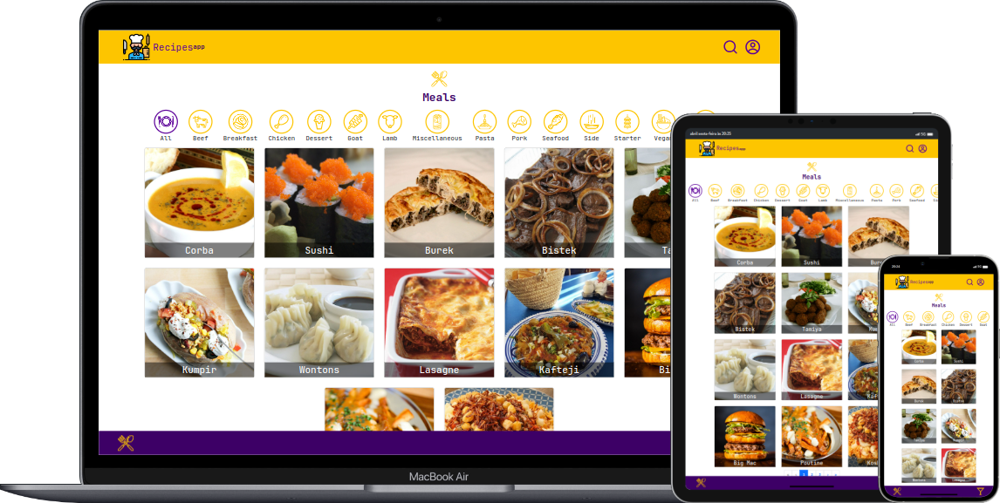

<h1 style="text-align: center">Recipes app</h1>



### About: :book:

> ###### This is a simple recipes app built with React, this app allows to manage the recipes that you want to try. The app is responsive and works on mobile, tablet and desktop devices.


### Technologies: :computer:
- React.js (Hooks, Context API)
- React Router
- Bootstrap
- Swiper.js
- LocalStorage
- jest
- react-testing-library (RTL)
- Mocha

### How to run the app: :octocat:
###### Clone the repository:
```bash
  git clone git@github.com:joseg-alvesg/recipes-app-react.git
  cd recipes-app-react
```

###### Install the dependencies:
```bash
  npm install
```

###### Run the app:
```bash
  npm start
```

### Contact: :mailbox:

<a href="mailto:cinhoalves85@gmail.com" >
  
</a>
<a href="https://wa.link/ea0wve'">
  
</a>
<a href="https://www.linkedin.com/in/joseg-alves/">
  
</a>
<a href="https://jose-alves-portfolio.vercel.app/">
  
</a>
